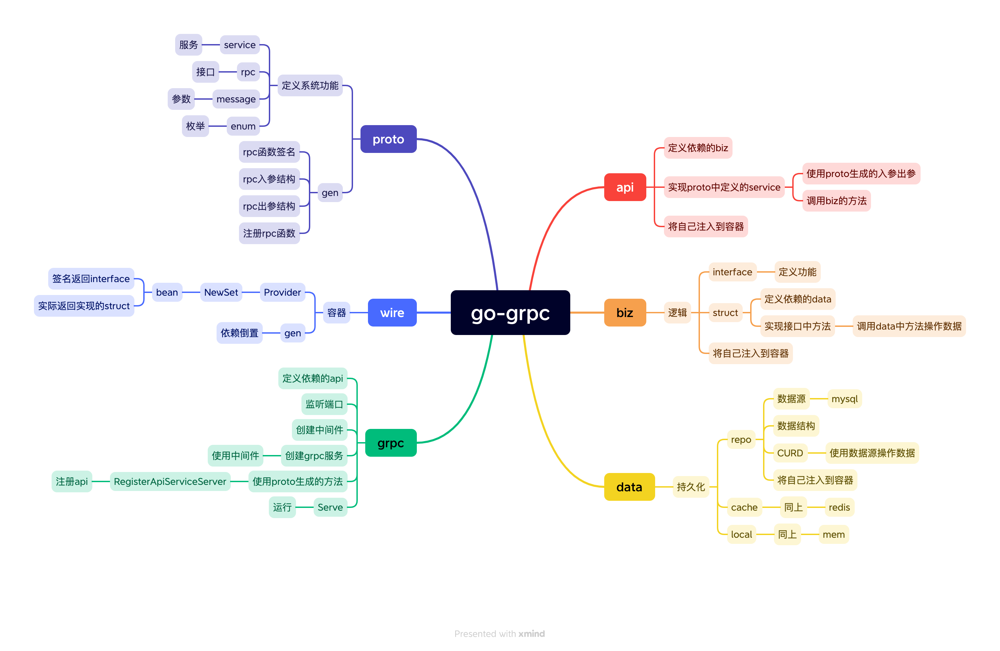

# go-grpc

* 基于 proto 和 grpc 的服务
* 使用 wire 做依赖倒置和容器管理
* 使用 interface 定义功能，再依次实现
* 数据储存支持 mysql、redis、memory
* 测试驱动开发，保障测试覆盖率



## Get started

> step by step

```
// protoc
brew install protobuf
protoc --version

// grpc
go install google.golang.org/protobuf/cmd/protoc-gen-go@v1.28
go install google.golang.org/grpc/cmd/protoc-gen-go-grpc@v1.2
protoc --go_out=. --go_opt=paths=source_relative \
    --go-grpc_out=. --go-grpc_opt=paths=source_relative \
    internal/proto/blog.proto

// wire
go install github.com/google/wire/cmd/wire@latest
cd cmd && wire

// run
cd cmd && go run . -env dev

// build
cd cmd && go build .

// test
cd test/pkg && go test -v
```

> makefile

```
// 更新 proto
make pb

// 更新 wire
make wire

// 更新全部
make all

// 运行 dev
make run

// 构建
make build
```

## Structure

```
├── cmd
│   ├── main.go     // 入口
│   ├── wire.go     // 容器根依赖，创建应用
│   └── wire_gen.go // wire 生成
├── configs
│   ├── dev.yaml    // 开发配置
│   ├── prod.yaml   // 生产配置
│   └── test.yaml   // 测试配置
├── doc             // 文档
├── go.mod
├── go.sum
├── internal
├── pkg             // 工具
│   └── request     // 请求第三方
├── readme.md   
└── test            // 测试
```

> internal

```
├── api
│   ├── api.go          // 继承 protoc 生成的 server
│   └── 一组接口.go      // 实现 protoc 生成的 rpc 方法
├── base
│   ├── cache.go        // redis 连接
│   ├── conf.go         // 各种配置
│   ├── db.go           // mysql 连接
│   ├── log.go          // 日志工具
│   └── provider.go     // 注册到容器
├── biz
│   ├── interface.go    // 定义业务该有的能力
│   └── 一组业务.go      // 一组业务的具体实现，逻辑及数据操作
├── data                // 数据操作
├── proto
│   ├── blog.pb.go      // protoc 生成
│   ├── blog.proto      // 定义该项目对外提供的功能
│   └── blog_grpc.pb.go // protoc 生成
└── server
    ├── grpc.go         // grpc 服务
    └── interface.go
```

> data

```
├── provider.go      // 收敛每个[table]的注册到容器方法
└── [table]
    ├── cache.go     // 缓存的操作
    ├── interface.go // 定义数据该有的能力
    ├── model.go     // 定义数据结构
    ├── provider.go  // 注册到容器
    └── dao.go       // 数据库的操作
```